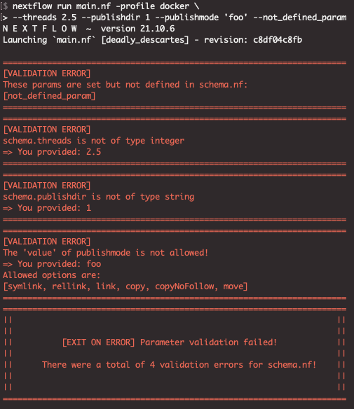

# nf-blank

**Note: This repository is active under development and comes without any warranty!**
<br>
<br>

[](https://www.nextflow.io/)
[](https://docs.conda.io/en/latest/)
[](https://www.docker.com/)
[](https://sylabs.io/docs/)

## Introduction

A minimal template for Nextflow DSL2 pipelines that is able to perform full params validation using only native Groovy/Nextflow without any external dependencies.
The params validation builds on a custom definition file `schema.nf`. Rather than using a schema that is not or poorly human readable such as JSONs we use simple Groovy maps to define params. Each map must consist of four keys:

1) **`value`**:     the default value of the param
2) **`type`**:      the expected type of `value`, one of `integer`, `float`, `numeric`, `string` or `logical`
3) **`allowed`**:   allowed choices for `value`
4) **`mandatory`**: a logical, whether this param must be set (`true`, so cannot be empty) or is optional
5) **`pattern`**: a groovy-compatible regex which value must match, see examples below. Only works for `type:'string'`

This followes Groovy rules, so integers and floats must not be quoted. Strings must be quoted. In case of multiple entries for `allowed` we use lists, see examples below.  

Note that only `value` and `type` must be set. The other three keys are optional and will be interpreted as empty if not set.

For parsing purposes the params **must not** be prefixed `params.` as we do for regular Nextflow params but **must** be prefixed as `schema`. This is because these "schema" params are stored in a map called `schema`, see the `schema.nf` script.

## Examples

**Example for an integer/float**: The default is 1, allowed choices are `1,2,3` and it is a mandatory param:
```groovy
schema.threads = [value:1, type:'integer', mandatory:true, allowed:[1,2,3]]`
```

One can either explicitely set `integer` or `float` or allow both types at the same time with `type: 'numeric'`.


**Example for a logical**: The default is `true` and choices are abviously `true/false` but in case of a logical type must not be specified in `allowed`:
```groovy
schema.do_alignment = [value:true, type:'logical', mandatory:true, allowed:'']`
```

`true/false` must not be quoted, otherwise they get interpreted as strings and a validation error will occur.  
Note that `allowed` must contain an empty string if left blank, otherwise it would lead to a parsing error.

**Example for the pattern key**:
```groovy
schema.memory = [value: '1.GB', type: 'string', mandatory: false, allowed: '', pattern: /^[0-9]+\.[0-9]*[K,M,G]B$/]
```

In this case the 'value' is validated against the 'pattern' regex. The regex means:
- `^[0-9]+\.` before the dot any numeral is allowed
- `[0-9]*` after the dot an optional numeral is allowed
- `[K,M,G]B$` end the string with any of K,M,G followed by B

Taken together this checks that `--memory` is e.g. `4.2GB` or `4.GB` so obeying the Nextflow syntax for memory params.  
This works only for strings and is disabled for types integer, float, numeric and logical.

Note that the regex pattern is **not quoted** as it is not a string.

You can simply explore the behaviour of the validation by running the example workflow via the following command. It assumes `samtools` in PATH by default, or requires the use of a profile to run via the hardcoded container or conda environment, e.g. `-profile docker/singularity/conda`.

```bash
nextflow run main.nf
```

...and then either parsing invalid parameters via the command line or changing keys in the `schema.nf`, see below for an example of a passed or failed validation.

## Validation workflow

The validation involves the following steps:

- validate that `schema.nf` is present in the `$baseDir` which is assumed to be the directory with the `main.nf`
- validate that `value` has the correct `type` (integer, float, numeric, string, logical)
- validate that all entries of `allowed` have the correct `type`
- validate that `mandatory` params are set
- validate that all params that are passed to Nextflow (be it command line, config files or from inside scripts) are defined in `schema.nf`
- validate that the correct Nextflow version is used. Currently, `schema.nf` has `schema.min_nf_version = '21.10.6'` and the validation checks for that version or greater.

The validation will run and then either print a params summary after successful validation, or print one error message per failed validation to `stdout`, and then eventually `exit 1`, not starting the main workflows in case of any failed validation.

The validation is fully compatible with "standard" Nextflow params, so the user can use config files, define params in scripts, via `-params-file` or the command line as usual, **given that the params have been defined in `schema.nf`**. If not, the validation will capture this by throwing an error and reporting which params have not been defined in `schema.nf`. The standard Nextflow rules apply in terms of [params priority](https://www.nextflow.io/docs/latest/config.html#configuration-file) with those defined in `schema.nf` being of lowest priority. That means that any "standard" params, e.g. from command line will be used if set, but undergo the same validation as the "schema" params.

The entire validation exclusively uses native Nextflow/Groovy syntax and comes without any external dependencies and without the need for any external GUIs (e.g. JSON editor as in nf-core params validation) as would be necessary (or recommended) when using schema setups that are difficult to read by eye such as JSONs or similar types of deeply nested formats. The actual validation code is in `functions/validate_schema_params.nf` and is evaluated on top of `main.nf`.

### Case: Successful validation

In case of a passed/successful validation a summary of all params is printed to `stdout`. Here we use the example data in `test/` to run the minimal example (sam2bam) workflow with defaults defined in `schema.nf`:

 


### Case: Failed validation
In case of a failed validation all conflicts will be printed to `stdout`. Here we intentionally give a float to `--threads` (expecting an integer), an integer to `--publishdir`(expecting a string), use a non-allowed option for `--publishmode` and pass a param that is not defined in `schema.nf`:



## Containers and conda environments

The toy module in this repo defines the container (Docker/Singularity) and/or conda `environment.yml` inside the module itself rather than in a config file. This then basically allows (in case of multiple modules) to use a separate container/env per module which can be helpful if software turns out to be incompatible, requiring different environments. In the example `schema.nf` the `schema.environment` (for conda) is defined as `"$baseDir/environment.yml"`. Mind the double- rather than single quotes because `$baseDir` in this case must be allowed to expand. A single-quoted string would not be expanded and as the schema.nf is a custom approach rather than an in-built Nextflow feature it would not be expanded internally without the double-quoting.

## GitHub Actions

We use [this Action](https://github.com/GuillaumeFalourd/assert-command-line-output) to run a CI ensuring that the schema validation works properly. It runs two workflows:

- First it checks whether the default run `nextflow run main.nf` runs successfully and passes the validation as it should.
- Second, it runs several processes where we intentionally pass invalid params, wrong value types and wrong Nextflow versions. The Action will then compare the command line outputs with the expected outputs in the `asserts/` folder. If identical then the test is a success. We do this because a failed schema validation actually returns an error (`error 1`) and this would create a failed CI. Using this Action we turn a failed validation (which is a success because the validation works properly which is what we want) into a success.

The expected values are created manually by running:

```bash
nextflow run main (...options) -bg | sed '1,2d;' > asserts/(...).txt
```

A more sophisticated Action might be added in the future which in a more general fashion checks whether a failed Nextflow run is due to code bugs (failed test) or due to a correct validation capturing invalid params (successful test). 
